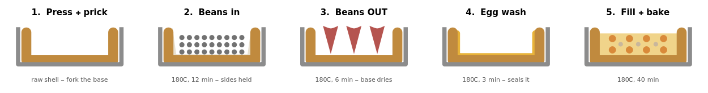

# Squash, Sage & Onion Quiche

*A savoury quiche built entirely from the odd flours in the cupboard — no plain wheat flour, no cheese, no butter. The crust is **pressed, not rolled, and deliberately low-fat**: 🌾 toasted oat flour and 🌱 quinoa flakes for flavour and mechanical grip, 💪 vital wheat gluten for cohesion, and a **pre-gelatinised 🍚 glutinous rice flour paste** doing the binding that fat would normally do — then an 🥚 egg-wash seal in place of fat's waterproofing. The filling is 🎃 roasted squash and deeply 🧅 caramelised onion in an egg custard thickened with more 🍚 glutinous rice flour (which stops a wet squash custard weeping), with 🍶 white miso and 🧀 nutritional yeast standing in for the gruyère and blended 🧊 cottage cheese carrying the body. 🌿 Dried sage ties it together. No chilli, no smoke, no peppers, no in-pot acid — clears every family flag. **A pantry run-down cook: vital wheat gluten, oat flour, glutinous rice flour, quinoa flakes, onions, sage, nutritional yeast.***

---

## Ingredients

| Type | Ingredient | Planned | Est. kcal | Actual used | USDA |
|:----:|:-----------|:-------:|--------:|:-----------:|:----:|
| 🟢 | 🌾 Oat flour (dry-toasted first) | 120 g | 485 | | [usda](https://fdc.nal.usda.gov/food-details/169741/nutrients) |
| 🟢 | 🌱 Quinoa flakes | 60 g | 221 | | [usda](https://fdc.nal.usda.gov/food-details/168874/nutrients) |
| 🟤 | 💪 Vital wheat gluten (BWFO) | 40 g | 148 | | label |
| 🟢 | 🍚 Glutinous rice flour (crust 40 g — 25 g as hot paste + custard 20 g) | 60 g | 222 | | [usda](https://fdc.nal.usda.gov/food-details/168883/nutrients) |
| 🟣 | 🥑 Avocado oil (rubbed into the crust) | 35 g | 309 | | local |
| 🟣 | 🧂 Salt (2 g crust, 2 g filling) | 4 g | 0 | | |
| 🔵 | 💧 Boiling water (for the rice-flour paste) | ~60 ml | 0 | | |
| 🟢 | 🎃 Butternut squash (diced, roasted) | 550 g | 248 | | [usda](https://fdc.nal.usda.gov/food-details/169295/nutrients) |
| 🟡 | 🧅 Onion (caramelised) | 300 g | 114 | | [usda](https://fdc.nal.usda.gov/food-details/2709795/nutrients) |
| 🟤 | 🥚 Eggs (4 medium; + 1 beaten for the seal — trace) | 200 g | 286 | | [usda](https://fdc.nal.usda.gov/food-details/171287/nutrients) |
| 🟣 | 🥛 Milk (semi-skimmed; 250 ml custard + 45 ml crust) | 295 ml | 139 | | local |
| 🟤 | 🧊 Cottage cheese (blended smooth) | 150 g | 108 | | [usda](https://fdc.nal.usda.gov/food-details/173417/nutrients) |
| 🟣 | 🍶 White miso | 15 g | 28 | | local |
| 🟣 | 🧀 Nutritional yeast | 15 g | 52 | | local |
| 🟠 | 🌿 Dried sage | 2 g | 6 | | [usda](https://fdc.nal.usda.gov/food-details/170935/nutrients) |
| | **Total** | **~1.9 kg** | **~2366** | | |

*Legend: 🟢 Vegetables · 🟡 Aromatics · 🟠 Spices / Pastes · 🔵 Stock · 🟤 Protein · 🟣 Seasoning*

*Totals are approximate — the planned weight includes the ~60 ml paste water. Est. kcal is per planned amount and summed in the Total row. Baked yield ~1650 g in a **25 cm × 4 cm** tin, cut into **8 slices** (~296 kcal each). **This is the low-fat crust revision** — crust oil cut 75 g → 35 g by replacing fat's binding and waterproofing functions rather than just removing it (see design notes).*

---

## Timeline

![Cooking Timeline](https://www.wolframcloud.com/obj/pirk0/RenderTimeline?steps=%7b%22Oven%22%3a%7b%22color%22%3a%22%23D1A83A%22%2c%22steps%22%3a%5b%5b0%2c10%2c%22Preheat+200C%22%5d%2c%5b10%2c35%2c%22Roast+squash%22%5d%2c%5b40%2c58%2c%22Blind+bake+crust+180C%22%5d%2c%5b58%2c61%2c%22Egg-wash+seal%22%5d%2c%5b65%2c105%2c%22Bake+quiche+180C%22%5d%5d%7d%2c%22Hob+%28onion%29%22%3a%7b%22color%22%3a%22%235AAD5A%22%2c%22steps%22%3a%5b%5b12%2c20%2c%22Microwave+onion+%2b+drain%22%5d%2c%5b20%2c32%2c%22Caramelise+in+pan%22%5d%5d%7d%2c%22Prep+%28crust%29%22%3a%7b%22color%22%3a%22%238C8C8C%22%2c%22steps%22%3a%5b%5b0%2c8%2c%22Toast+oat+flour%22%5d%2c%5b8%2c12%2c%22Rice-flour+paste+-+cool%22%5d%2c%5b28%2c38%2c%22Rub+oil+in+-+paste+-+milk+-+press+-+rest%22%5d%5d%7d%2c%22Blender%22%3a%7b%22color%22%3a%22%23B772B7%22%2c%22steps%22%3a%5b%5b58%2c63%2c%22Blend+custard+smooth%22%5d%5d%7d%7d&syncs=%5b%7b%22t%22%3a38%2c%22color%22%3a%22%23B8902E%22%2c%22label%22%3a%22Crust+in%22%7d%2c%7b%22t%22%3a61%2c%22color%22%3a%22%23B8902E%22%2c%22label%22%3a%22Sealed%22%7d%2c%7b%22t%22%3a65%2c%22color%22%3a%22%23B8902E%22%2c%22label%22%3a%22Filling+in%22%7d%2c%7b%22t%22%3a115%2c%22color%22%3a%22%23595959%22%2c%22label%22%3a%22Rest+then+serve%22%7d%5d)

*~115 min including a rest. The oven does four jobs back to back: roast the 🎃 squash, blind bake the crust, set the 🥚 egg-wash seal, bake the quiche. The 🧅 onion caramelises on the hob in parallel, and the 🌾 oat flour gets toasted (plus the 🍚 rice-flour paste made and cooled) at the very start while the oven comes up.*

---

## Method

> **Note:** Dice the 🎃 squash ~2 cm (skin off here — unlike the soup, this one isn't blended, so skin would read as tough flecks). Slice the 🧅 onion thin.
>
> ⚠ **Tin: 25 cm × 4 cm deep, loose-bottomed.** The filling comes to ~1220 ml once the squash has roasted down and the onion caramelised, and **a 23 × 3.5 cm tin holds only ~1080 ml — it will overflow.** 25 × 4 cm leaves comfortable headroom (~80 % full); 23 × 4.5 cm also works at a pinch (~84 %).

1. **Toast the oat flour, and make the paste.** 🌾 Oat flour in a dry pan over medium, stirring, ~5 min until it smells nutty and darkens a shade — the single biggest flavour step; untoasted oat flour tastes pasty. Cool it. Then **whisk 25 g of the 🍚 glutinous rice flour into ~60 ml boiling 💧 water** until it thickens to a stiff, sticky paste, and leave it to cool. *(Pre-gelatinising the starch is what makes it adhesive — this paste is the crust's main binder, doing the job the missing fat would have done.)*

2. **Roast the squash.** 🎃 Squash on a tray, **200 °C, ~25 min** until soft with browned edges. **Do not boil it** — boiled squash carries water into the custard and makes it weep.

3. **Caramelise the onion.** 🧅 Onion in a covered bowl with a pinch of 🧂 salt, **microwave 8–10 min**, stirring once, until properly translucent — then **drain the liquid off**. Oil lightly and finish in a hot pan ~10 min until genuinely brown. *(Microwave does the softening, the pan does the browning — the split that makes this fast.)*

4. **Make the crust — oil first, then paste, then milk.** Combine the toasted 🌾 oat flour, 🌱 quinoa flakes, 💪 vital wheat gluten, the remaining 15 g dry 🍚 glutinous rice flour and 2 g 🧂 salt. **Rub the 🥑 oil through the dry mix first**, until it looks like damp sand — coating the gluten in fat still matters, there's just less of it to go round. Work in the cooled 🍚 rice-flour paste, then add 🥛 milk (~45 ml) a splash at a time until it just comes together. Don't knead.

5. **Press, rest, blind bake with beans, then seal.** Press into the tin, up the sides. **Rest 10 min** — oat flour and 🌱 quinoa flakes both keep absorbing, and with less oil the dough is stiffer, so judge hydration *after* the rest and patch cracks then. Prick the base all over with a fork. Line with crumpled parchment and **fill with baking beans, banked right up the sides** — with 40 g of 💪 gluten in the dough the crust will otherwise **shrink down the walls** as the protein sets. **Blind bake 180 °C, 12 min → lift out beans and parchment → back in 6 min** so the base actually dries (leave the beans in throughout and it steams under them). Then **brush the hot shell with beaten 🥚 egg and return it for 3 min** until the film sets glossy. *(The seal is not optional in the low-fat version — fat was the waterproofing, and without it the wet custard soaks straight into the crust.)*



*Cross-section through the tin at each stage — grey = tin, gold band = crust. Panels 2→3 are the pair that matter: the beans hold the walls, then come **out** so the base can dry; panel 4's thin yellow line is the egg seal standing in for the fat that was removed.*

> 🫘 **Short of beans?** A 25 cm tin wants **~700 g** to bank properly and retail packs are usually 500 g. Ceramic beans have no magic — they're just dense, dry weight. **Put the ceramic ones against the sides where the shrinkage happens and bulk out the middle with dried chickpeas, butter beans or rice** from the pantry. Keep them in a jar marked for baking afterwards; they dry out and won't cook properly again.

6. **Blend the custard.** Blend the 🥚 eggs, 🥛 milk, 🧊 cottage cheese, remaining 20 g 🍚 glutinous rice flour, 🍶 white miso, 🧀 nutritional yeast, 🌿 sage, 2 g 🧂 salt and plenty of black pepper until completely smooth. **The 🧊 cottage cheese must be blended smooth — never leave visible curds** (the standing rule, same as for silken tofu).

7. **Fill and bake.** Scatter the roasted 🎃 squash and caramelised 🧅 onion over the blind-baked crust, pour the custard over, and bake **180 °C, ~40 min** until just set with a faint wobble at the centre. It firms up as it cools.

8. **Rest 10 min before cutting** — a hot quiche slumps.

---

## Nutrition

*Total values for the whole quiche (~1650 g baked, 8 slices → **~296 kcal / 16.4 g protein / 9.9 g fat / 1.0 g salt per slice**). **USDA-derived + labels, not FoodNoms-verified** — computed in Wolfram; micros are committed best-estimates. **Fat ~79 g, down from 120 g in the first draft** — the crust oil was cut 75 g → 35 g by *replacing* fat's functions (binding → pre-gelatinised 🍚 rice-flour paste; cohesion → more 💪 gluten; waterproofing → 🥚 egg-wash seal) rather than simply removing it. At ~9.9 g/slice that's roughly a third of a butter-shortcrust quiche. Protein **rises** to ~132 g (~16.4 g/slice) — 💪 gluten and 🌱 quinoa flakes both bring more than the oat flour they displaced. Calcium ~1088 mg (🥛 milk + 🧊 cottage cheese + 🌿 sage). **Salt 7.6 g total** — only 4 g is added; the rest rides in on the 🧊 cottage cheese (~1.5 g), 🍶 miso and 🥚 eggs, which is why the added salt is deliberately restrained.*

```wolfram
(* Vector: {kcal, prot, carb, sugar, fat, sat, fibre, salt,
            iron, calcium, zinc, magnesium, potassium, vitD, B12, folate}
   Per 100 g/ml. carb INCLUDES fibre (US convention). Salt in g; sodium = salt*400. *)
n100 = <|
  "oatflour" -> {404, 14.66, 65.7, 0.8, 9.12, 1.607, 6.5, 0.048, 4.0, 55, 3.2, 144, 371, 0, 0, 32}, (* USDA 169741 *)
  "quinoa"   -> {368, 14.12, 64.16, 0, 6.07, 0.706, 7.0, 0.013, 4.57, 47, 3.1, 197, 563, 0, 0, 184}, (* USDA 168874, flakes = rolled *)
  "gluten"   -> {370, 75.0, 15.0, 0, 1.9, 0.3, 0.6, 0, 5.2, 142, 0.85, 25, 100, 0, 0, 0}, (* BWFO label + usda micros *)
  "glutrice" -> {370, 6.81, 81.68, 0, 0.55, 0.111, 2.8, 0.018, 1.6, 11, 1.2, 23, 77, 0, 0, 7}, (* USDA 168883 *)
  "oil"      -> {884, 0, 0, 0, 100, 11.56, 0, 0, 0, 0, 0, 0, 0, 0, 0, 0}, (* avocado *)
  "salt"     -> {0, 0, 0, 0, 0, 0, 0, 100, 0, 0, 0, 0, 0, 0, 0, 0},
  "squash"   -> {45, 1.0, 11.69, 2.2, 0.1, 0.021, 2.0, 0.01, 0.7, 48, 0.15, 34, 352, 0, 0, 27}, (* USDA 169295 *)
  "onion"    -> {38, 0.86, 8.46, 5.8, 0.08, 0.042, 1.7, 0.003, 0.24, 17, 0.17, 9, 171, 0, 0, 19}, (* USDA 2709795 *)
  "eggs"     -> {143, 12.56, 0.72, 0.37, 9.51, 3.126, 0, 0.355, 1.75, 56, 1.29, 12, 138, 2, 0.89, 47}, (* USDA 171287 *)
  "milk"     -> {47, 3.6, 4.8, 4.8, 1.8, 1.1, 0, 0.1, 0.03, 124, 0.4, 11, 150, 0, 0.4, 9}, (* semi-skimmed, milk.co.uk *)
  "cottage"  -> {72, 12.39, 2.72, 2.72, 1.02, 0.645, 0, 1.015, 0.14, 61, 0.38, 5, 86, 0, 0.63, 12}, (* USDA 173417 *)
  "miso"     -> {190, 11.0, 26.0, 6.3, 6.0, 1.0, 2.5, 6.0, 2.49, 57, 2.56, 48, 210, 0, 0.08, 19}, (* white miso, local *)
  "nooch"    -> {349, 47.0, 39.0, 1.0, 5.0, 1.0, 20.0, 0.2, 5, 30, 8, 100, 1200, 0, 0, 250}, (* local, BWFO *)
  "sage"     -> {315, 10.63, 60.73, 1.71, 12.75, 7.03, 40.3, 0.028, 28.12, 1652, 4.7, 428, 1070, 0, 0, 274} (* USDA 170935 *)
|>;
amounts = <| "oatflour" -> 120, "quinoa" -> 60, "gluten" -> 40, "glutrice" -> 60, "oil" -> 35, "salt" -> 4,
             "squash" -> 550, "onion" -> 300, "eggs" -> 200, "milk" -> 295, "cottage" -> 150,
             "miso" -> 15, "nooch" -> 15, "sage" -> 2 |>;
totals = N[Total[Table[n100[k] * amounts[k] / 100.0, {k, Keys[amounts]}]], 5];
```

*FoodNoms collection: **Squash, Sage & Onion Quiche [26-07-26] ✴️**. **⬇ [download `.foodnoms`](https://www.wolframcloud.com/obj/pirk0/BuildFoodNomsRecipe?name=Squash%2c+Sage+%26+Onion+Quiche+%5b26-07-26%5d+%e2%9c%b4%ef%b8%8f&servings=8&totalServingSize=1650&fdcIds=169741%2c168874%2c168883%2c169295%2c2709795%2c171287%2c173417%2c170935&grams=120%2c60%2c60%2c550%2c300%2c200%2c150%2c2&customNames=Vital+Wheat+Gluten+%28BWFO%29%3bOil+%28Avocado%29%3bSalt%3bMilk+%28Semi-Skimmed%29%3bWhite+Miso%3bNutritional+Yeast+Flakes&customFoodIds=local%3aBAA2E5C2-08FC-ECED-501D-4C4933398839%3blocal%3a46D6CFD7-5184-4C62-A572-0F04A6D25009%3blocal%3a5A170000-0000-4000-8000-000000000001%3blocal%3a24C74E7A-6DD7-4CB8-821D-DB3BDCF9CB0D%3blocal%3a0CF95E20-08C5-4FFF-B889-E25F0B144CF9%3blocal%3aA79EC48D-C9A5-43A9-9F24-C57821BECF60&customQuantities=40%3b35%3b4%3b295%3b15%3b15&customUnits=gram%3bgram%3bgram%3bmilliliter%3bgram%3bgram&customNutrientNames=calories%2cprotein%2ccarbs%2csugars%2cfat%2cfatSaturated%2cfiber%2csodium%2ciron%2ccalcium%2czinc%2cmagnesium%2cpotassium%2cvitaminD%2cvitaminB12%2cfolate%3bcalories%2cprotein%2ccarbs%2csugars%2cfat%2cfatSaturated%2cfiber%2csodium%2ciron%2ccalcium%2czinc%2cmagnesium%2cpotassium%2cvitaminD%2cvitaminB12%2cfolate%3bcalories%2cprotein%2ccarbs%2csugars%2cfat%2cfatSaturated%2cfiber%2csodium%2ciron%2ccalcium%2czinc%2cmagnesium%2cpotassium%2cvitaminD%2cvitaminB12%2cfolate%3bcalories%2cprotein%2ccarbs%2csugars%2cfat%2cfatSaturated%2cfiber%2csodium%2ciron%2ccalcium%2czinc%2cmagnesium%2cpotassium%2cvitaminD%2cvitaminB12%2cfolate%3bcalories%2cprotein%2ccarbs%2csugars%2cfat%2cfatSaturated%2cfiber%2csodium%2ciron%2ccalcium%2czinc%2cmagnesium%2cpotassium%2cvitaminD%2cvitaminB12%2cfolate%3bcalories%2cprotein%2ccarbs%2csugars%2cfat%2cfatSaturated%2cfiber%2csodium%2ciron%2ccalcium%2czinc%2cmagnesium%2cpotassium%2cvitaminD%2cvitaminB12%2cfolate&customNutrientValues=370%2c75%2c15%2c0%2c1.9%2c0.3%2c0.6%2c0%2c5.2%2c142%2c0.85%2c25%2c100%2c0%2c0%2c0%3b884%2c0%2c0%2c0%2c100%2c11.56%2c0%2c0%2c0%2c0%2c0%2c0%2c0%2c0%2c0%2c0%3b0%2c0%2c0%2c0%2c0%2c0%2c0%2c40000%2c0%2c0%2c0%2c0%2c0%2c0%2c0%2c0%3b47%2c3.6%2c4.8%2c4.8%2c1.8%2c1.1%2c0%2c40%2c0.03%2c124%2c0.4%2c11%2c150%2c0%2c0.4%2c9%3b190%2c11%2c26%2c6.3%2c6%2c1%2c2.5%2c2400%2c2.49%2c57%2c2.56%2c48%2c210%2c0%2c0.08%2c19%3b349%2c47%2c39%2c1%2c5%2c1%2c20%2c80%2c5%2c30%2c8%2c100%2c1200%2c0%2c0%2c250)** — generated only when clicked; totals verified to this table (HTTP 200, 2366 kcal, 14 entries).*

| Macro | Total | Micro | Total |
|:------|------:|:------|------:|
| Energy | 2366 kcal | Iron | 21 mg |
| Protein | 132 g | Calcium | 1088 mg |
| Carbohydrates | 293 g | Zinc | 14 mg |
| — of which sugars | 51 g | Magnesium | 624 mg |
| Fat | 79 g | Potassium | 4399 mg |
| — of which saturates | 18 g | Vitamin D | 4.0 µg |
| Fibre | 34 g | Vitamin B12 | 3.9 µg |
| Salt | 7.6 g | Folate | 543 µg |

---

## Diagram source

*Wolfram source for `img/blind-bake.png` above — regenerate or export to vector with the final line.*

```wolfram
crust = RGBColor["#C08A3E"]; tin = GrayLevel[0.55]; bean = GrayLevel[0.45];
parch = RGBColor["#E8E0CF"]; egg = RGBColor["#E8B33A"]; cust = RGBColor["#F0D48A"];
squash = RGBColor["#D98A3A"]; onionC = RGBColor["#C9B79C"]; heat = RGBColor["#B5544F"];

shell = {crust, Thickness[0.014], JoinForm["Round"], CapForm["Round"],
   Line[{{-0.84, 0.62}, {-0.84, 0.08}, {0.84, 0.08}, {0.84, 0.62}}]};
tinL = {tin, Thickness[0.006], JoinForm["Round"],
   Line[{{-1, 0.68}, {-1, 0}, {1, 0}, {1, 0.68}}]};
pricks = {crust, Thickness[0.004],
   Sequence @@ Table[Line[{{x, 0.05}, {x, 0.14}}], {x, -0.6, 0.6, 0.24}]};
beans = {parch, Thickness[0.005],
   Line[{{-0.79, 0.66}, {-0.72, 0.16}, {0.72, 0.16}, {0.79, 0.66}}], bean,
   Sequence @@ Flatten[Table[Disk[{x, y}, 0.05], {y, 0.24, 0.52, 0.14}, {x, -0.58, 0.58, 0.145}]]};
arrows = {heat, Thickness[0.005],
   Sequence @@ Table[Arrow[{{x, 0.52}, {x, 0.2}}], {x, -0.45, 0.45, 0.45}]};
wash = {egg, Thickness[0.009], JoinForm["Round"], CapForm["Round"],
   Line[{{-0.76, 0.6}, {-0.76, 0.155}, {0.76, 0.155}, {0.76, 0.6}}]};
fill = {cust, Polygon[{{-0.78, 0.155}, {0.78, 0.155}, {0.78, 0.6}, {-0.78, 0.6}}], squash,
   Sequence @@ Table[Disk[{x, y}, 0.07], {y, 0.28, 0.5, 0.22}, {x, -0.5, 0.5, 0.33}], onionC,
   Sequence @@ Table[Disk[{x, 0.39}, 0.045], {x, -0.34, 0.34, 0.34}]};

panels = {{1, "Press + prick", "raw shell - fork the base", pricks},
   {2, "Beans in", "180C, 12 min - sides held", beans},
   {3, "Beans OUT", "180C, 6 min - base dries", arrows},
   {4, "Egg wash", "180C, 3 min - seals it", wash},
   {5, "Fill + bake", "180C, 40 min", fill}};

plot = Graphics[Table[With[{p = panels[[i]], dx = 2.75 (i - 1)},
    Translate[{p[[4]], shell, tinL, Black,
      Text[Style[ToString[p[[1]]] <> ".  " <> p[[2]], 15, Bold, FontFamily -> "Helvetica"], {0, 1.0}],
      GrayLevel[0.35],
      Text[Style[p[[3]], 11.5, FontFamily -> "Helvetica"], {0, -0.3}]}, {dx, 0}]], {i, 5}],
   PlotRange -> {{-1.35, 2.75*4 + 1.35}, {-0.55, 1.25}},
   ImageSize -> 1250, Background -> White, PlotRangePadding -> 0];

Export["blind-bake.pdf", plot]
```

---

## Design notes

- **Designed around three flours that are all wrong for pastry.** There was no plain wheat flour in the house: 🌾 oat flour has **no gluten** (sandy, unrollable), 🍚 "glutinous" rice flour despite the name contains **no gluten either** — it's near-pure amylopectin that goes chewy, never crisp — and 💪 vital wheat gluten is ~75 % pure elastic protein, which is the *opposite* problem. A rolled shortcrust was therefore impossible; a **press-in crust** needs none of the missing properties, so that's the route.
- **Fat before liquid — the technique the crust depends on.** Rubbing the 🥑 oil through the dry mix *first* coats the gluten particles and stops them hydrating into an elastic network. Add liquid to bare gluten and you get a rubber mat. This ordering is what makes a 40 g gluten addition helpful rather than ruinous.
- **Cutting the crust fat 75 g → 35 g: replace the functions, don't just remove the fat.** Fat was doing **four** jobs, and three of them have substitutes: **binding → a pre-gelatinised 🍚 glutinous-rice-flour paste** (25 g whisked into 60 ml boiling water; cooked amylopectin is genuinely adhesive — it has been used as literal mortar — and is far stickier than the raw flour it replaces); **cohesion → more 💪 vital wheat gluten** (30 → 40 g; with less fat suppressing it, the gluten now hydrates properly and forms a real network, so lean into it rather than fighting it — 40 g is the ceiling before it turns rubbery); **waterproofing → the 🥚 egg-wash seal** (the job people forget, and skipping it is what produces a soggy bottom once the fat barrier is gone). The fourth job — **shortening/tenderness — has no substitute**, and that's the real price: the crust reads firmer and more galette-like, less crumbly-short. Acceptable in a quiche; it would not have been in the sweet version. **Don't push below ~30 g oil** — past that it goes dry and chalky no matter how good the binders are, because you've removed mouthfeel rather than structure. Net effect: 120 g → 79 g fat for the quiche, ~15 → ~9.9 g per slice, with protein *rising*.
- **🌱 Quinoa flakes replace 60 g of the oat flour.** Larger, irregular particles interlock mechanically when pressed in a way fine flour can't — useful precisely when there's less fat gluing things together — and they bring more protein, magnesium and folate plus a nuttier bite.
- **Gluten belongs here, unlike in a sweet pie.** A sweet custard pie wants a short, tender crust and gluten wrecks it. A quiche crust has a different job — holding a wet custard for 40 minutes without going soggy — so a slightly firmer, more galette-like base is a feature. This is also the recipe's biggest **run-down win** on the BWFO gluten stock, and the low-fat revision leans on it harder (40 g).
- **🍚 Glutinous rice flour does two different jobs.** In the crust (20 g) it's the binder that stops the oat flour collapsing into sand. In the custard (20 g) it's a **stabiliser against weeping** — squash is wet and squash custards split readily; the amylopectin sets silky rather than rubbery and is freeze–thaw stable. Held to 20 g in the filling: more and you get a faint mochi bounce, which reads wrong in savoury.
- **Toast the oat flour.** Untoasted it tastes of wallpaper paste; toasted it's nutty and is the crust's main flavour. Its earthiness is a liability under a delicate sweet filling but an asset under roasted squash and onion — part of why savoury was the better call.
- **No cheese, by necessity and design.** The house stocks no melting cheese, so the gruyère role is split three ways: 🍶 white miso for savoury depth, 🧀 nutritional yeast for the cheesy top note, and blended 🧊 cottage cheese for body and protein. **The cottage cheese must be blended smooth** — the standing family rule (visible curds are a Lara problem, same as silken tofu).
- **Roast the squash, never boil it.** Same rule as the chickpea–butternut soup: roasting concentrates the sugar and, critically here, keeps water out of a custard that would otherwise weep. Skin comes off for this one (unlike the soup) since nothing is blended and skin would read as tough flecks.
- **Salt restrained on purpose.** Only 4 g is added; 🧊 cottage cheese (~1.5 g), 🍶 miso and 🥚 eggs bring the total to 7.6 g (~1.0 g/slice). Season the custard by taste before it goes in — you can't adjust once it's baked.
- **Clears every family flag.** No chilli, no smoke, no cooked peppers, no in-pot acid; creamy, mild and sweet-leaning from the squash and caramelised onion — the register that put Jannes at the top of his range on the chickpea–butternut soup. 🌿 Sage + squash + onion is the same autumnal trio as the white bean soup.

---

## Cook log

- **Designed 2026-07-26 — untested.** Built to use up the odd cupboard flours (1 kg oat flour, 1 kg glutinous rice flour, a large stock of BWFO vital wheat gluten) plus a squash, with no plain flour and no cheese in the house. Started as a sweet squash-custard pie; switched to savoury, which suited the ingredients better — the oat flour's earthiness became an asset and the vital wheat gluten went from unusable to genuinely helpful.
- **Revised same day to the low-fat crust** (this version). First draft carried 75 g of oil in the crust; cut to **35 g** by substituting for fat's functions — pre-gelatinised rice-flour paste for binding, more gluten for cohesion, an egg-wash seal for waterproofing — plus 60 g quinoa flakes displacing oat flour for mechanical grip and protein. Whole quiche **2609 → 2366 kcal**, fat **120 → 79 g** (~15 → ~9.9 g/slice), protein **121 → 132 g**. The accepted cost is a firmer, less short crust. Not yet cooked or rated; nutrition is USDA-derived pending a FoodNoms reconciliation on the cook.
